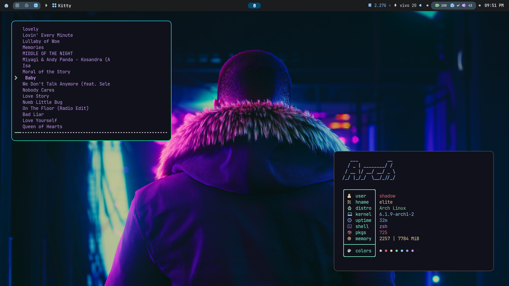

# Hyprdot

hyprland dot files 



## Install

Install a AUR First like [yay](https://github.com/Jguer/yay)

### requirments
```bash
yay -Sy --noconfirm && yay -S --noconfirm stow hyprland-git waybar-hyperland-git wl-clipboard hyprpicker-git kitty firefox pulseaudio libpulse lsof grim telegram-desktop wireplumber pavucontrol brightnessctl xdg-desktop-portal-hyprland-git polkit-kde-agent qt5ct qt6ct nwg-look-bin sweet-gtk-theme-dark colloid-icon-theme-git thunar gnome-calculator bat rofi-lbonn-wayland-git bc swww-git
```
### Install config
```bash
rm ~/.zshrc && cd hypr && stow */
```
## Custom Shortcuts

| use | key| 
| :-| :- |
| kitty | <kbd>SUPER</kbd> + <kbd>ENTER</kbd>  
| rofi | <kbd>SUPER</kbd> + <kbd>SPACE</kbd> |
| firefox | <kbd>SUPER</kbd> + <kbd>F</kbd> |
| telegram | <kbd>ALT</kbd> + <kbd>T</kbd> |


### Additional

* wall --> `swww init` 
* font --> `fc-cache -vf`
* shell --> `zsh <(curl -s https://raw.githubusercontent.com/zap-zsh/zap/master/install.zsh)`
* neovim Plug --> `sh -c 'curl -fLo "${XDG_DATA_HOME:-$HOME/.local/share}"/nvim/site/autoload/plug.vim --create-dirs \
       https://raw.githubusercontent.com/junegunn/vim-plug/master/plug.vim'` 

	then `:PlugInstall`

## Config Used
```diff
	@@ !MOST OF THE CONFIG TAKEN FROM EXTERNAL REPOS AND SLIGHTLY CONFIGURED! @@
```
 soon
